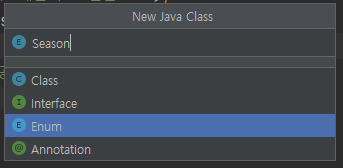

# 아이템 3. private 생성자나 열거 타입으로 싱글턴임을 보증하라

### 일단 이것을 알기 전에 열거 타입이 무엇인지를 알아야 한다.

## 열거 타입(enum)이란?  

### 몇가지 상수의 집합을 정의하는 한정된 값만을 갖는 데이터 타입으로,   
### 집합이 갖는 값이 한정되어 있고, 다른 값을 허용하지 않는 경우에 사용한다. 
  
예)  
> 성별 : 남성, 여성  
> 요일 : 월, 화, 수, 목, 금, 토, 일  
> 계절 : 봄, 여름, 가을, 겨울 

 

## 열거 타입(enum)의 장점  

#### 1. 열거체를 비교할 때 **실제 값** 뿐만 아니라 **타입**까지 `체크`해 준다.
#### 2. 열거체의 상숫값이 **재정의**되더라도, 다시 컴파일할 필요가 `없어진다`.

 

## 열거 타입(enum) 선언 방법  

### Intellij 기준으로 New -> Java Class -> Enum 을 선택하여 클래스를 생성 할 수 있다.
### 일단 예를 들어서 계절 열거체를 만들어 보자.
  

### 먼저 열거체 이름(Season)을 지정해 주고
### 열거 상수를 선언해 주자.
~~~JAVA
public enum Season {
    // 열거 상수 선언
    SPRING,
    SUMMER,
    AUTUMN,
    WINTER
}
~~~

### 열거 상수는 모두 대문자로 작성한다.
### 만약 열거 상수가 여러 단어로 구성되어 있다면, 단어 사이를 밑줄(_)로 연결하는 것이 관례이다.  

예)  
~~~JAVA
public enum LoginResult{
    // 열거 상수
    LOGIN_SUCCESS,
    LOGIN_FAILED
} 
~~~

 

## 선언된 열거 타입(enum) 사용 방법
### 이렇게 선언된 열거체를 사용하는 방법은 다음과 같다
~~~JAVA
public class SeasonEnum {
    public static void main(String[] args) {

        // 열거 타입으로 변수(season2022) 선언 후, 열거 상수 값 할당해주기.
        // 열거 상수는 단독으로 사용 할 수 없어, 앞에 열거타입이 붙어야 한다.
        Season season2022 = Season.SPRING;
        // 이렇게 출력해보면 SPRING 이 출력된다.
        System.out.println(season2022);

        // 그리고 열거 타입 변수도 참조 타입이기 때문에, null 값을 저장 할 수 있다.
        season2022 = null;
        // 이렇게 출력하보면 null 이 출력된다.
        System.out.println(season2022);
    }
}
~~~

#### `new` 연산자로는 열거타입을 생성할 수 `없고`, 열거변수를 선언하여 열거상수 값을 **할당**시켜줘야 한다.
#### 열거타입 변수에 저장되는 값은 **참조변수**로, Stack 영역에 주소 값이 생성된다.
#### 이 때 `열거타입 변수`의 주소값과 `열거상수`의 주소값은 같은 영역을 참조하기 때문에 `동일한 값`을 가진다.

---
 

## 싱글톤(Singleton)이란?
- #### 어플리케이션이 실행될 때, 어떤 클래스가 한번만 메모리에 할당하고, 그 메모리에 인스턴스를 만들어 사용하는 디자인 패턴이다.
- #### 다시말해, 객체의 인스턴스가 오직 **1개만 생성**되는 패턴을 의미한다.

 

## 싱글톤(Singleton)의 장점
#### 1. 한번의 new 연산자를 통해 고정된 메모리 영역을 사용하기 때문에 추후 해당 객체에 접근 할 때, 메모리 낭비를 방지할 수 있다.
#### 2. 이미 생성된 인스턴스를 활용해서 속도 측면에도 이점이 있다.
#### 3. 전역으로 사용되는 인스턴스이기 때문에 다른 클래스 간에 데이터 공유가 쉽다.

 

## 싱글톤(Singleton)의 단점
#### 1. **private** 생성자를 가지고 있기 때문에 상속 할 수 없다.
#### 2. **서버환경**에서는 싱글턴이 하나만 만들어지는 것을 보장하지 못한다.
#### 3. 싱글톤은 객체지향 프로그래밍에서 권장되지 않는 **전역 상태**를 만들 수 있기 때문에 바람직하지 못하다.

 

## 싱글톤(Singleton)의 생성방법
#### 싱글톤의 가장 일반적인 생성 방식은 두 가지가 있다.
#### 두 방식 모두 생성자는 `private` 로 감춰두고, 인스턴스에 접근할 수 있는 유일한 수단으로 `public static` 맴버를 하나 마련해 둔다.

 

### 1. public static 맴버가 final 필드인 방식 
~~~JAVA
public class Singleton1{
    // public static final 맴버
    public static final Singleton1 s1 = new Singleton1();
    // private 생성자
    private Singleton1() { }

    public void doSomething() { }
}
~~~
실행문
~~~JAVA
public class MainSingleton {
    public static void main(String[] args) {
        // public static 맴버가 final 필드인 방식의 Singleton
        Singleton1 chk1_s1 = Singleton1.s1;
        Singleton1 chk2_s1 = Singleton1.s1;
        // 둘이 주소값이 같은지 확인
        System.out.println(chk1_s1 == chk2_s1);
    }
}
~~~
결과
~~~
true
~~~

---

 

### 2. 정적 팩터리 메서드를 public static 맴버로 제공하는 방식 
~~~JAVA
public class Singleton2 {
    // public static final 맴버
    public static final Singleton2 s2 = new Singleton2();
    // private 생성자
    private Singleton2() { }
    // 정적 팩토리 메서드
    public static Singleton2 getInstance(){ return s2; }

    public void doSomething2() { }
}
~~~
실행문
~~~JAVA
public class MainSingleton {
    public static void main(String[] args) {
        // 정적 팩터리 메서드를 public static 멤버로 제공하는 방식의 Singleton
        Singleton2 chk1_s2 = Singleton2.getInstance();
        Singleton2 chk2_s2 = Singleton2.getInstance();
        // 둘이 주소값이 같은지 확인
        System.out.println(chk1_s2 == chk2_s2);
    }
}
~~~
결과
~~~
true
~~~

---

 

### [public static 맴버가 final 필드인 방식](#novice1)의 장점
#### 1. 해당 클래스가 싱글턴임이 API에 명확히 드러난다.
#### 2. 간결하다.

 

### [ 정적 팩터리 메서드를 public static 맴버로 제공하는 방식](#novice2)의 장점
#### 1. getInstance() 메서드는 항상 같은 객체의 참조를 반환하므로, 다른 인스턴스는 만들어 지지 않는다.
#### 2. API를 바꾸지 않고도 싱글턴이 아니게 바꿀 수 있다.(getInstance() 에서 리턴하는 값을 바꾸면 된다.)
#### 3. 정적 팩터리 메서드를 제너릭 싱글턴 팩터리로 만들 수 있다.(아이템 30)
#### 4. 정적 팩터리 메서드 참조를 Supplier로 사용할 수 있다.(호출한 곳으로 데이터를 리턴하는 역활을 한다.)

 

## 하지만!!!
### 이 두 방식에는 치명적인 단점이 존재한다.
### 만약 이 방법들을 직렬화에 사용한다면, 역직력화 할 때 **새로운 인스턴스**가 생겨서 싱글턴이 아니게 되어 버린다.
### 이것을 해결하려면 모든 인스턴스 필드를 직렬화 대상에서 **제외(transient)**한다 선언하고, **readResolve** 메서드를 제공해야 한다.
### 하지만 이러한 노력을 들여 귀찮은 방식을 써서 해결하는 방법 대신, 열거타입을 사용하여 싱글턴을 사용하는 방법이 있다.

 

## 3. 열거 타입 싱글턴
~~~JAVA
public enum Singleton3 {
    s3;
    public void doSomething2() { }
}
~~~
실행문
~~~JAVA
public class MainSingleton {
    public static void main(String[] args) {
        // 열거 타입 싱글턴
        Singleton3 chk1_s3 = Singleton3.s3;
        Singleton3 chk2_s3 = Singleton3.s3;
        // 둘이 주소값이 같은지 확인
        System.out.println(chk1_s3 == chk2_s3);
    }
}
~~~
결과
~~~
true
~~~

### 위의 두 방법보다 열거 타입 싱글턴 방식이 더 좋은 이유
### 1. 열거타입을 사용한 방법이 코드가 간결해서 좋다. (협업자가 빠르게 읽을 수 있다.)
### 2. 사용할 때 싱글톤임이 명확하게 보인다. (협업자가 싱글톤 객체를 사용했다는 걸 알기 쉽다.)
### 3. 열거타입(enum) 자체가 serialization(직렬화)과 thread-safety를 보장한다.

 

### 다만 한가지 단점이 존재하는데, 상위 클래스를 상속 할 수 없다.
### 그래서 만들려는 싱글턴이 열거타입(enum) 이외의 다른 상위 클래스를 상속해야 한다면, 이 방법은 사용할 수 없다.